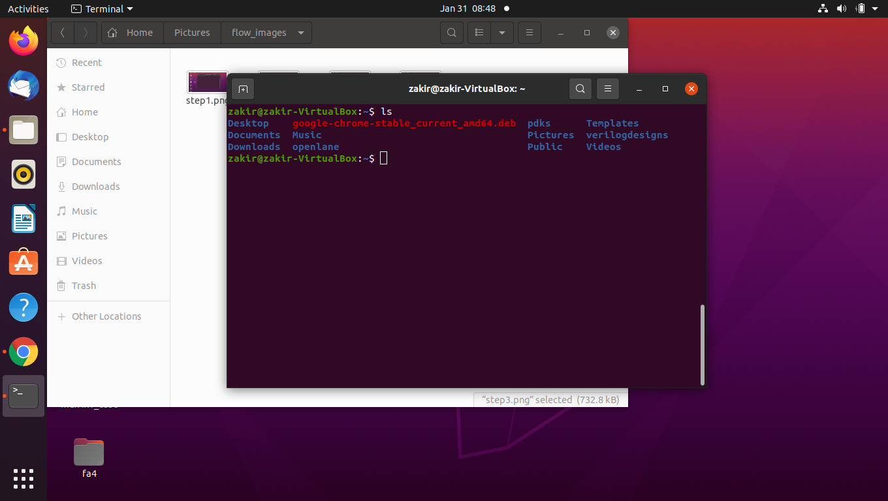
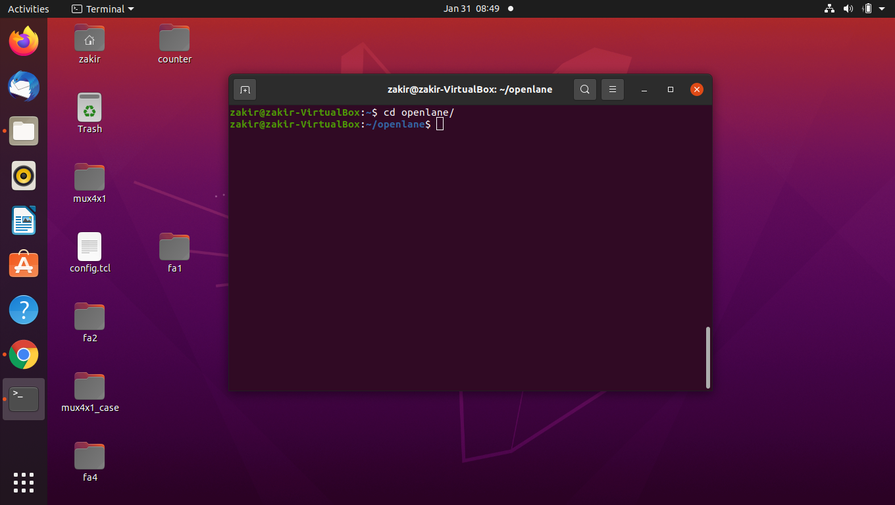

The following flow I have learned during the VSD Sky130 OpenLANE workshop. I was aware prior to this workshop about directly running 
all the flow starting with Synthesis to Routing through the single script. This workshop had given me the insights on how to use openlane
interactively. 

1. How to use openlane in interactive mode

2. Interactive mode includes the following 

    1. Synthesis
    2. Floorplanning 
    3. Placement of the standard cells
    4. CTS : Clock Tree Synthesis 
    5. PDN : Power Distribution Network
    6. Routing 
    
3. This workshop also had taugt me how to build the standard cells in order to use with openlane flow, infact it is how standrd cell libraries are built.

Let me walk you through at first how do we do the entire flow that is starting from synthesis to routing of the design. 

STEPS: 

1. open the terminal in your ubutntu system and type the cd(change directory) so that you can go to your home directory 

      
      
2. Now type pwd (print working directory) command in the terminal to see that currently in which directory are you in
      
      
      
3. Now type ls command to see all the files and filders in your home directory 
    
     
     
4. Now type cd openlane in the terminal, so that you can be in the openlane directory 

    
    
5. Now type ls in the terminal to see the contents of openlane directory 

    
    
6. Now we have to run the following two commands to get into openlane's command prompt 

    1. export PDK_ROOT=\<absolute path to where skywater-pdk and open_pdks will reside\>
    2. docker run -it -v $(pwd):/openLANE_flow -v $PDK_ROOT:$PDK_ROOT -e PDK_ROOT=$PDK_ROOT -u $(id -u $USER):$(id -g $USER) openlane:rc6
    
    
    
7. Now to create your design, you have to type the folowing in the openlane's command prompt

    ./flow.tcl -design <design_name> -init_design_config
    
    for example let's say, you thought of creating 3-bit adder and you may like to call that design's name as adder3bit
    in that case 
    ./flow.tcl -design adder3bit -init_design_config
    
    
    
    
    
    This will create the following directory structure:

designs/<design_name>
├── config.tcl
    
    To observe the above, you can open the new terminal[not openlane's command prompt] and check the following[see the image]
    
    
    
    <b>INSTALLATION NOTES:</b> 
    
    please refer this site https://github.com/efabless/openlane
